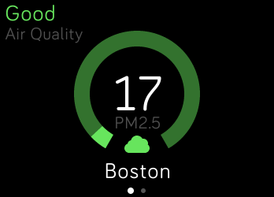
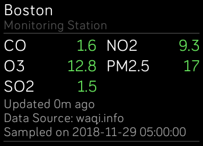

# Air Quality

See air quality reports from 10k monitoring stations around the world. Reports are in the form of calculated AQI (Air Quality Index) for major air pollutants. The higher the AQI value, the greater the level of air pollution and the greater the health concern. Air pollutant with the highest AQI is shown on the main screen for the selected monitoring station. Tap the screen to see complete AQI list. Scroll down to access historical data.

Features: 
- add up to 3 monitoring stations
- see data from the nearby station
- see distance to the nearby station
- air sampling time and date (station local time)
- use photo from your mobile device as background
- track historical data (max AQI values for the last 5 days)
- customize fetch schedule




Get the app here https://gam.fitbit.com/gallery/app/b66657c1-f6d2-4397-af8c-50992340e8b4

## Installation

Get [AQICN](http://aqicn.org/data-platform/token/#/) token

git clone https://github.com/Ed2Bs/fitbit-air-quality-app.git

cd fitbit-air-quality-app

Add file resources/appconfig.json with following content: 

```
{
  "app": {
    "name": "AirQuality",
    "version": "3.7.6"
  },
  "trackingId": "Your Google Analytics tracking ID",
  "token": "Your AQICN token",
  "wakeInterval": {
    "values": [
      {
        "name": "Hourly",
        "value": 3600000
      }
    ],
    "selected": [
      0
    ]
  }
}
```

npm install

npx fitbit-build generate-appid

npx fitbit-build

npx fitbit

fitbit$ install


For more info visit [Get started](https://dev.fitbit.com/getting-started/) with the Fitbit Software Development Kit (SDK)

### License

Licensed under the [MIT License](./LICENSE).
